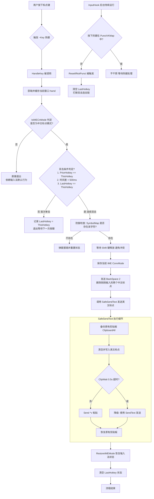

# easy-typing
[easy-typing-obsidian](https://github.com/Yaozhuwa/easy-typing-obsidian)部分功能的AutoHotkey实现，在所有输入框中享受无缝的中英文标点切换。
> 几乎完全由AI编写，真正意义上的vibe coding史山。

## 功能说明：
在搜狗输入法中文模式下，【连续按两次】标点键，自动将其替换为英文标点。
例如：按两次「，」变成「,」，按两次「。」变成「.」。

支持自定义符号转换。

## 使用方法
### 将`SymbolFunc.ahk`文件导入已有的AutoHotkey应用。
以导入[MyKeymap](https://github.com/xianyukang/MyKeymap)为例：
1. 将文件`SymbolFunc.ahk`放入MyKeymap\data\
2. 修改原有文件`custom_functions.ahk`（参考原有文件内的注释）
   > 添加`#Include ../data/SymbolFunc.ahk`至第一行

### 直接[AutoHotkey v2](https://www.autohotkey.com/)执行

## 执行流程图

