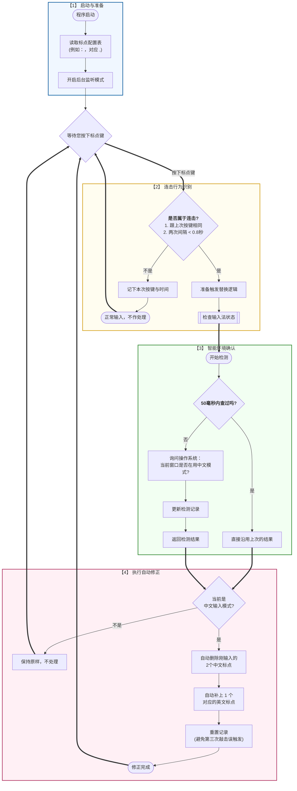
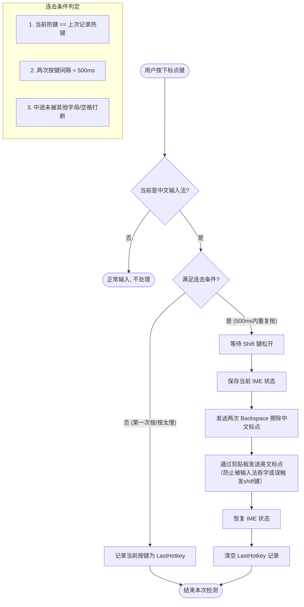
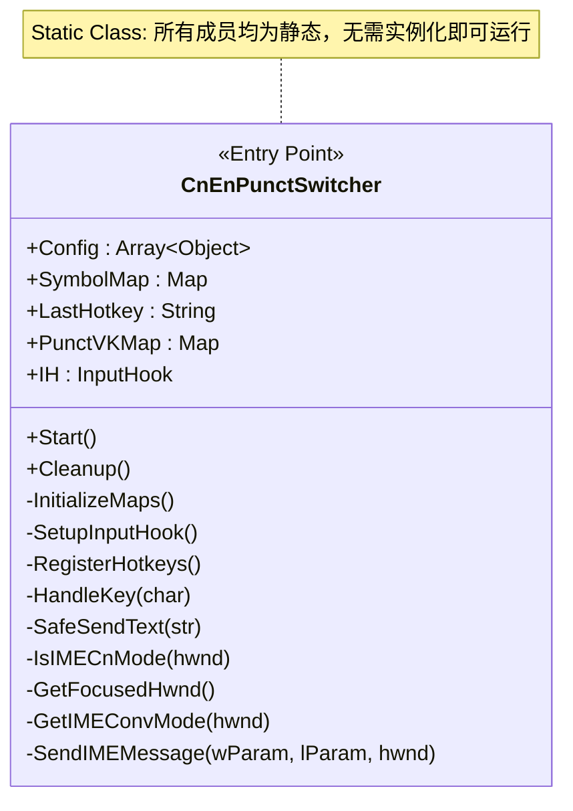

# easy-typing-ahk
[easy-typing-obsidian](https://github.com/Yaozhuwa/easy-typing-obsidian)部分功能的AutoHotkey实现，在所有输入框中享受无缝的中英文标点切换。

窗口检测参考[InputTip](https://github.com/abgox/InputTip)的部分逻辑。
> 几乎完全由AI编写，真正意义上的vibe coding史山。

## 功能说明：
在搜狗/微软输入法中文模式下，【连续按两次】标点键，自动将其替换为英文标点。
例如：按两次「，」变成「,」，按两次「。」变成「.」。
> 其他输入法未测试，若替换失效可修改检测输入法状态的参数后再次尝试运行。

### 自定义
支持在代码开端自定义以下内容：
1. `DOUBLE_CLICK_INTERVAL`连击间隔（毫秒）
2. `IME_CACHE_TIME`IME状态缓存时间（性能优化）
3. `PUNCTUATION_MAP`标点配置表

## 使用方法
### 1. 将`CnEnPunctSwitcher版本号.ahk`（如CnEnPunctSwitcher1.ahk）文件导入已有的AutoHotkey应用。
以导入[MyKeymap](https://github.com/xianyukang/MyKeymap)为例：
1. 将文件`CnEnPunctSwitcher版本号.ahk`放入MyKeymap\data\
2. 修改原有文件`custom_functions.ahk`（参考原有文件内的注释）
   > 添加`#Include ../data/CnEnPunctSwitcher版本号.ahk`至第一行

### 2. 直接使用[AutoHotkey v2](https://www.autohotkey.com/)执行

---

## 流程关系图示
### CnEnPunctSwitcher2.ahk
#### 执行流程图

---
### CnEnPunctSwitcher1.ahk
#### 执行流程图

#### 类关系图

